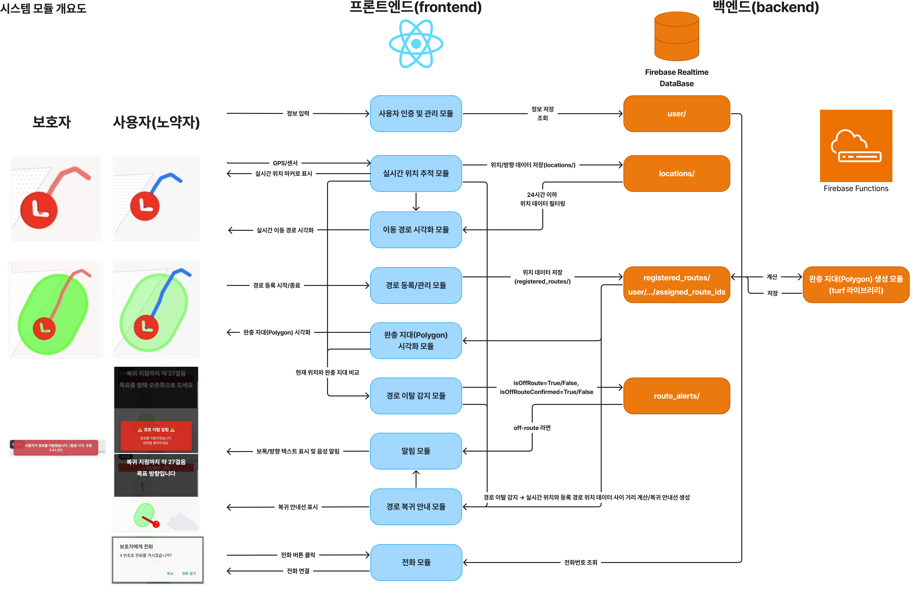
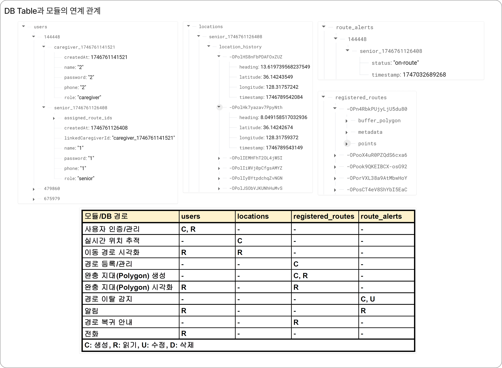

# CarePath: 인지·거동 미흡 노약자를 위한 경로 이탈 감지 및 알림 서비스

## 🌟 프로젝트 개요

**CarePath**는 인지 기능이나 거동이 불편하신 노약자분들이 평소 다니시는 경로를 등록하고, 해당 경로를 이탈했을 때 **본인과 보호자에게 즉시 알림을 제공**하여 안전을 확보하는 모바일 애플리케이션입니다. 이 프로젝트는 캡스톤 디자인 최종발표회 출품작으로 개발되었습니다.

일상생활에서 자주 이용하는 경로를 기반으로 안심 구역을 설정함으로써, 단순한 구역 기반 알림 서비스의 한계를 극복하고 실제 생활 패턴에 맞는 정밀한 모니터링을 목표로 합니다.

## ✨ 주요 기능

1.  **사용자 관리 및 인증 (노인/보호자)**
    *   노인과 보호자 계정 분리 및 회원가입/로그인 기능 제공
    *   보호자는 노인 계정과 그룹 ID를 통해 연동되어 관리

2.  **실시간 위치 추적 및 공유**
    *   `react-native-community/geolocation`을 활용한 GPS 및 네트워크 기반 실시간 위치 수집
    *   수집된 위치 정보는 Firebase Realtime Database에 주기적으로 저장
    *   보호자는 연동된 노인의 현재 위치 및 과거 24시간 이동 경로(Polyline)를 지도에서 확인
    *   배터리 효율과 정확도를 고려한 위치 수집 옵션 (enableHighAccuracy, distanceFilter, interval) 적용

3.  **자이로스코프 연동 (이동 방향 시각화)**
    *   `react-native-sensors`를 활용하여 사용자의 스마트폰 방향 감지
    *   지도 위 마커(화살표)가 사용자의 이동 방향에 따라 실시간으로 회전하여 직관적인 방향 안내

4.  **경로 등록 및 관리**
    *   노인 사용자는 자주 다니는 경로를 지도 위에서 직접 이동하며 실시간으로 등록 가능
    *   등록된 경로는 Firebase Realtime Database에 위치 데이터 포인트들로 저장 (`registered_location`)

5.  **안심 구역(폴리곤) 자동 생성**
    *   Firebase Functions와 `@turf/turf` 라이브러리(`buffer` 함수)를 활용
    *   등록된 경로를 기반으로 주변 일정 거리(예: 9m)의 완충 지대(Buffer Zone)를 폴리곤 형태로 자동 생성
    *   생성된 폴리곤 정보는 DB에 저장되고, 사용자와 보호자 앱 지도에 반투명으로 시각화

6.  **경로 이탈 감지 및 알림**
    *   사용자의 현재 위치가 등록된 모든 안심 구역(폴리곤) 외부에 있는지 `@turf/boolean-point-in-polygon`으로 실시간 감지
    *   **사용자(노인) 알림:**
        *   경로 이탈 시 즉각적인 시각적 알림 (화면 팝업), 음성 안내 ("경로를 벗어났습니다."), 진동 알림 제공
        *   알림은 포그라운드 상태에서 동작
    *   **보호자 알림:**
        *   노인의 경로 이탈 상황 발생 시, Firebase DB (`route_alerts`) 상태 변경을 통해 보호자 앱에 텍스트 알림 전송
        *   보호자는 이탈 발생 시각 및 현재 위치 확인 가능

7.  **경로 복귀 안내 (시각적/청각적)**
    *   경로 이탈 시, 현재 위치에서 가장 가까운 원 경로 위의 지점(`@turf/nearestPointOnLine` 활용)을 복귀 목표 지점으로 설정
    *   현재 위치부터 목표 지점까지 직선의 복귀 안내선(Polyline)을 지도에 표시
    *   남은 거리(보폭 수) 및 나아가야 할 방향(좌/우)을 계산하여 화면 및 음성으로 안내 (예: "오른쪽으로 도세요", "복귀 지점까지 약 15걸음")
    *   `react-native-sound`를 활용한 MP3 음성 안내 파일 재생

8.  **전화 연결 기능**
    *   경로 이탈 등 위급 상황 시, 앱 내에서 보호자에게 바로 전화 연결 가능

## 🎥 주요 기능 시연

*프로젝트의 핵심 기능 시연 영상입니다. **이미지를 클릭하면 YouTube 영상이 재생됩니다.** (일부 공개 영상)*

### 1. 사용자 (노약자) 화면 작동 영상

### 2. 보호자 화면 작동 영상

## 🛠️ 기술 스택

*   **Frontend:** React Native
    *   `@react-native-community/geolocation`: 위치 정보 수집
    *   `react-native-maps`: 지도 표시 및 상호작용
    *   `react-native-sensors`: 자이로스코프 센서 데이터 수집
    *   `react-native-sound`: 음성 안내 재생
*   **Backend (Serverless):** Firebase Functions (Node.js, TypeScript)
    *   `@turf/turf`: GIS 공간 연산 (폴리곤 생성, 지점 포함 여부, 거리 계산 등)
*   **Database:** Firebase Realtime Database
*   **Version Control:** Git, GitHub

## 📐 시스템 아키텍처

애플리케이션은 React Native 기반의 프론트엔드와 Firebase를 활용한 백엔드로 구성됩니다.

1.  **프론트엔드 (사용자/보호자 앱)**
    *   **사용자 인증 및 관리 모듈:** 회원가입, 로그인 처리.
    *   **실시간 위치 추적 모듈:** GPS/센서 데이터 수집 후 Firebase DB로 전송.
    *   **이동 경로 시각화 모듈:** DB에서 위치 이력을 받아 Polyline으로 지도에 표시.
    *   **경로 등록/관리 모듈:** 사용자의 이동 경로를 DB에 저장.
    *   **완충 지대(Polygon) 시각화 모듈:** DB에서 폴리곤 데이터를 받아 지도에 표시.
    *   **경로 이탈 감지 모듈:** 현재 위치와 완충 지대를 비교하여 이탈 여부 판단.
    *   **알림 모듈:** 이탈 시 시각/청각/촉각 알림 생성.
    *   **경로 복귀 안내 모듈:** 복귀 경로 계산 및 안내.
    *   **전화 모듈:** 보호자에게 전화 연결.

2.  **백엔드 (Firebase)**
    *   **Firebase Realtime Database:**
        *   `user/`: 사용자 정보 (노인, 보호자, 그룹 ID 등)
        *   `locations/`: 사용자의 실시간 위치 이력
        *   `registered_routes/`: 사용자가 등록한 경로 데이터 및 해당 경로의 `buffer_polygon` 좌표
        *   `route_alerts/`: 경로 이탈 발생 시 알림 상태 정보
    *   **Firebase Functions:**
        *   `registered_routes`에 새로운 경로가 등록되면, Turf.js를 사용하여 해당 경로 주변의 완충 지대(Polygon)를 계산하고 DB에 저장.

**DB Table과 모듈 연계:**

## 👥 역할 분담

- [최승식](https://github.com/seungsikchi): 팀장, 시연 영상 제작
- [박정현](https://github.com/JungH200000): 기획, UI/UX 설계 및 구현, Frontend·Server·DB 설계 및 구현
- [박상현](https://github.com/huneyo): Frontend 구현, PPT 제작
  
## 🚀 향후 개선 사항

1.  **사용자 맞춤형 음성 안내 도입:**
    *   보호자(가족)가 직접 음성을 녹음하여 경로 이탈 및 방향 안내 시 사용자의 주의를 더 효과적으로 끌고 심리적 안정감 제공.
    *   `react-native-audio-recorder-player` 등을 활용한 녹음 기능 및 기존 `react-native-sound`를 통한 재생.
2.  **백그라운드 위치 추적 및 알림 강화:**
    *   앱이 백그라운드에 있거나 종료된 상태에서도 위치 추적 및 경로 이탈 감지, 알림 기능이 안정적으로 동작하도록 개선.
    *   `react-native-background-geolocation` 라이브러리 도입 고려.
3.  **지능형 경로 복귀 안내 개선:**
    *   현재의 직선 안내 방식에서 나아가, 실제 도로망 및 장애물을 고려한 최적의 도보 경로 안내.
    *   Google Maps Directions API 등을 활용하여 사용자의 현재 위치에서 가장 가까운 원 경로 복귀 지점까지의 실제 도보 경로 Polyline 제공.
4.  **생활안전정보 연동:**
    *   행정안전부 등의 공공데이터포털에서 제공하는 생활안전지도(우범지역, 위험시설 등) 정보와 연동하여, 경로 설정 및 이탈 시 위험지역 회피 안내 기능 추가.

## 📝 개발 과정에서 얻은 주요 교훈

*   **프레임워크 및 라이브러리 버전 관리의 중요성:** 프로젝트 초기, 최신 버전의 라이브러리가 항상 최선의 선택은 아니라는 점을 깨달았습니다. 특정 라이브러리를 도입할 때, 단순히 공식 문서의 설명은 물론 해당 라이브러리의 데모 애플리케이션이나 `package.json` 파일을 직접 확인하여 현재 사용 중인 프레임워크(예: React Native) 및 다른 주요 라이브러리들과의 버전 호환성을 면밀히 검토하는 과정이 필수적임을 경험했습니다. 이로 인해 예기치 않은 빌드 오류나 런타임 문제를 사전에 방지하고 안정적인 개발 환경을 유지하는 데 도움이 되었습니다.
